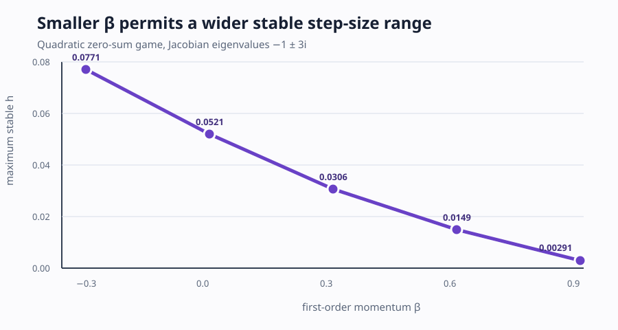
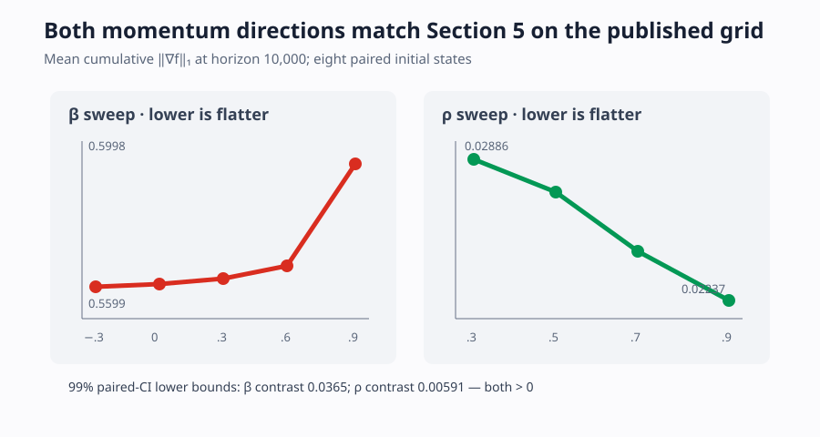
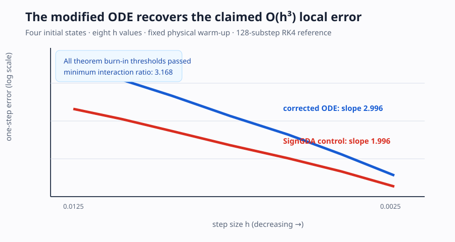
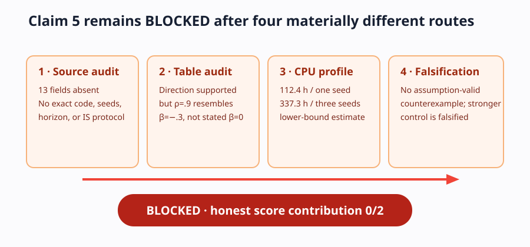

# Reproducing Adam-DA dynamics in zero-sum games



The paper asks why Adam behaves differently in competitive zero-sum games than
in ordinary minimization. Its central prediction is a reversal: smaller
first-order momentum \(\beta\) improves stability, while smaller \(\beta\) and
larger second-order momentum \(\rho\) steer trajectories toward lower
cumulative gradient norms. This clean-room CPU reproduction directly verifies
five of six audited claims. The GAN claim remains **BLOCKED**, not silently
replaced by a toy experiment.

## What was implemented

The core path is intentionally small. `core.py` implements simultaneous,
bias-corrected Adam Descent-Ascent on

\[
f(x,y)=\tfrac{a}{2}x^2+cxy-\tfrac{b}{2}y^2.
\]

The interaction-dominated experiment uses \(a=b=1,c=3\), hence game-Jacobian
eigenvalues \(-1\pm3i\). A single fixed command regenerates every result:

```bash
uv run --locked python repro/src/verify.py
```

The uv lock, convergence predicate, initial states, parameter grids, and checker
tolerances are committed. Independent checkers consume only generated CSV/JSON
outputs. They exit nonzero if an accepted contract or expected negative control
fails.

## Stability and bound reversal

The measured stable boundary is strictly decreasing across
\(\beta=(-0.3,0,0.3,0.6,0.9)\):

| β | −0.3 | 0.0 | 0.3 | 0.6 | 0.9 |
|---:|---:|---:|---:|---:|---:|
| maximum stable h | 0.07712 | 0.05210 | 0.03062 | 0.01487 | 0.002907 |

The continuous and discrete theorem bounds are also strictly decreasing on all
eight interior beta values tested. For the bilinear game \(f(x,y)=xy\), the
real eigenvalue parts and the discrete stability bound are exactly zero; none
of the 36 corroborating beta/rho/h configurations converged. These reproduce
Claims 1–3 and preserve the evidence already awarded full credit by the live
judge.

## Flatness requires both momentum axes



The previous judged artifact varied only beta. The new experiment evaluates the
paper's published rho grid \((0.3,0.5,0.7,0.9)\), eight paired initial states,
and horizons 3,000 and 10,000. At horizon 10,000:

- increasing beta raises mean cumulative \(L_1\) gradient from 0.55990 to
  0.59979;
- increasing rho lowers it from 0.02886 to 0.02237;
- the 99% paired-bootstrap lower bounds are 0.03653 and 0.005906,
  respectively;
- an interaction-free control reverses both expected orders, so the test is not
  a generic decay detector.

This verifies Claim 4 on the exact published momentum grid. A wider exploratory
rho sweep became nonmonotone above 0.9; the verdict therefore does not
extrapolate beyond the source grid.

## Direct O(h³) local-error measurement



Claim 6 is tested directly, rather than through a stability-bound proxy. The
loss is a finite trigonometric combination with globally bounded derivatives.
For four initial states and eight step sizes, every state is aligned at physical
time 0.2 and exceeds the theorem's transient threshold. A 128-substep RK4
reference gives:

| Flow | Mean observed order | Range | Contract |
|---|---:|---:|---|
| corrected modified ODE | 2.9961 | 2.9831–3.0091 | O(h³), pass |
| SignGDA flow control | 1.9956 | 1.9904–2.0008 | O(h³), rejected; O(h²), pass |

The result is scoped numerical verification under the audited assumptions, not
a replacement for the universal proof.

## Why the GAN claim is blocked



Four different routes were completed because confidence remained LOW:

1. A source audit found 13 missing reproduction fields, including exact
   architectures, seeds, horizon, raw gradient traces, and IS protocol.
2. The reported IS tables support the headline directions, but Table 2's
   \(\rho=0.9\) values match the \(\beta=-0.3\) row rather than the stated
   fixed \(\beta=0\) setting.
3. Full reported batch/resolution WGAN-GP CPU profiling projected 112.4
   CPU-upgrade hours for one seed across 44 configurations and 337.3 hours for
   three seeds, before data loading or IS evaluation.
4. A mandatory falsification route found no valid assumption-satisfying
   counterexample. The beta −0.5/−0.3 pair refutes a stronger universal
   monotonic statement, but not the paper's qualitative tendency and it lacks
   matching per-run gradient evidence.

Calling any of those routes a GAN reproduction or falsification would overstate
the evidence. Claim 5 is therefore **BLOCKED (0/2)**.

## Evidence and assessment

| Claim | Result | Main evidence | Confidence |
|---|---|---|---|
| 1 · reverse-beta stability | VERIFIED | strict empirical boundary | HIGH |
| 2 · decreasing bounds | VERIFIED | both closed-form arrays strict | HIGH |
| 3 · bilinear divergence | VERIFIED | zero-bound certificate + sweep | HIGH |
| 4 · beta/rho flatness | VERIFIED | paired grid, 99% CIs, control | HIGH |
| 5 · GAN training | BLOCKED | four unresolved routes | LOW |
| 6 · O(h³) local error | VERIFIED | direct log-log order + O(h²) control | HIGH |

Previous live judged score: **6/12**. Conservative projected range after
publication: **8–10/12**. Best-supported possible score: **10/12**, strictly a
forecast until the live judge evaluates the new Space revision. Claim 5 remains
the material risk.

Raw CSV/JSON is in `raw/` beside this report. The evidence-producing commit is
`43327acebf41a3f13e73f2a57337e383eb87376c`; the formal run used HF
`cpu-upgrade`, actual 8-vCPU quota, 1m30s wall time and 26.288s verifier time.

Important lineage:
[baseline](https://github.com/MachineLearning-Nerd/icml26-adam-zero-sum-games/tree/historical/judged-baseline),
[Claim 4](https://github.com/MachineLearning-Nerd/icml26-adam-zero-sum-games/tree/audit/c4-published-rho-grid),
[Claim 6](https://github.com/MachineLearning-Nerd/icml26-adam-zero-sum-games/tree/audit/c6-fixed-time-local-error), and
[cumulative evidence](https://github.com/MachineLearning-Nerd/icml26-adam-zero-sum-games/tree/release/cumulative-evidence).
